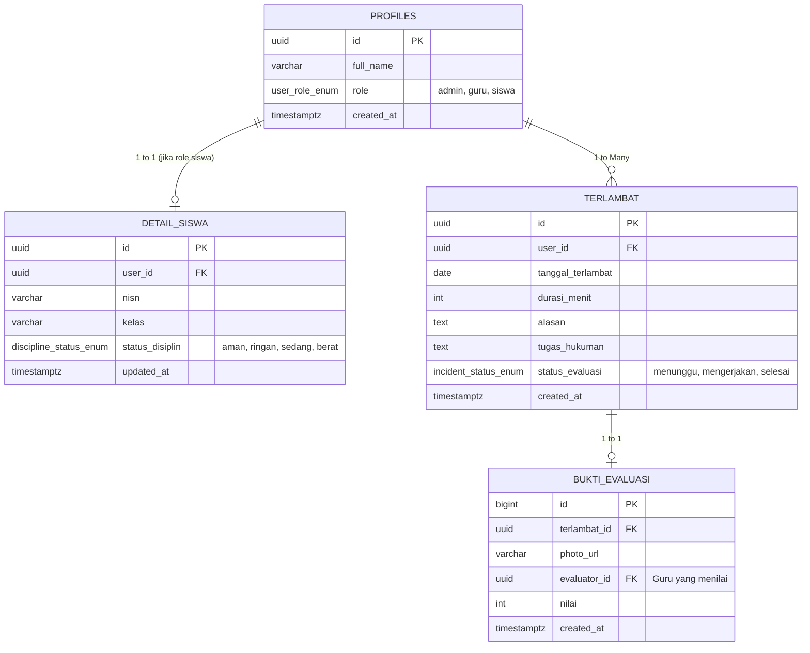

# Arsitektur Database & Panduan Schema V2 (TertibSekolah)

Dokumen ini dibuat khusus untuk mempermudah **Junior Developer** atau kontributor baru dalam memahami struktur database terbaru pada project **TertibSekolah**.

Supabase (PostgreSQL) digunakan sebagai basis data utama. Pada versi ke-2 ini, kita melakukan normalisasi struktur agar lebih rapi, konsisten, dan mudah dikembangkan.

---

## 1. Entity Relationship Diagram (ERD)

Berikut adalah relasi antar tabel dalam database kita. Diagram ini menunjukkan bagaimana setiap entitas saling terhubung:

---

## 2. Penjelasan Tabel

### A. `profiles`
Tabel utama untuk semua pengguna aplikasi (Siswa, Guru, dan Admin). Tabel ini dibuat secara otomatis setiap kali ada pendaftaran pengguna baru (melalui Firebase Auth / Supabase Auth).
*   **`id`**: ID unik pengguna (Primary Key).
*   **`full_name`**: Nama lengkap pengguna.
*   **`role`**: Peran pengguna (menggunakan ENUM: `admin`, `guru`, `siswa`).

### B. `detail_siswa`
Tabel ini merupakan perpanjangan (ekstensi) dari tabel `profiles` khusus untuk pengguna dengan role `siswa`.
*   **`nisn`** & **`kelas`**: Data spesifik siswa.
*   **`status_disiplin`**: Menentukan tingkat pelanggaran (Aman, Ringan, Sedang, Berat).
> [!NOTE]  
> **Trigger Otomatis:** Saat pengguna baru mendaftar dengan role `siswa` di tabel `profiles`, database secara otomatis akan membuat baris kosong (default) di tabel `detail_siswa`. Developer tidak perlu melakukan `INSERT` manual!

### C. `terlambat` (Sebelumnya `attendance`)
Menyimpan riwayat keterlambatan siswa.
*   **`durasi_menit`**: Lama keterlambatan.
*   **`tugas_hukuman`**: Hukuman/tugas yang diberikan oleh guru.
*   **`status_evaluasi`**: Status pengerjaan tugas (Menunggu, Mengerjakan, Selesai).

### D. `bukti_evaluasi` (Sebelumnya `evaluations`)
Menyimpan bukti foto pengerjaan tugas dan nilai dari guru.
*   **`photo_url`**: Link foto bukti tugas.
*   **`nilai`**: Nilai evaluasi dari guru (jika >= 75 berarti lulus).

---

## 3. Workflow & Logika Otomatis (Triggers)

Untuk mengurangi kompleksitas di sisi Frontend (Flutter), banyak logika bisnis yang sekarang dipindahkan langsung ke Database (PostgreSQL Triggers & Functions).

### 🚀 Alur Evaluasi Tugas
1. **Guru** memberikan tugas keterlambatan -> `terlambat.status_evaluasi` berubah menjadi `'mengerjakan'`.
2. **Siswa** mengunggah foto bukti -> Aplikasi Flutter melakukan `INSERT` ke `bukti_evaluasi` dan mengubah `terlambat.status_evaluasi` menjadi `'selesai'`.
3. **Guru** memberikan nilai >= 75 -> Aplikasi Flutter mengupdate `bukti_evaluasi.nilai`.
4. Jika **Nilai < 75**, data di `bukti_evaluasi` dihapus, dan `terlambat.status_evaluasi` dikembalikan ke `'mengerjakan'`.

### ⚡ Otomatisasi Status Disiplin
Terdapat Trigger PostgreSQL bernama `trg_update_siswa_tardiness`. 
Setiap kali ada penambahan atau perubahan data di tabel `terlambat`, sistem akan otomatis menghitung total keterlambatan siswa bulan ini dan mengupdate kolom `status_disiplin` di tabel `detail_siswa`.

**Aturan Default:**
*   `aman`: 0-2 kali terlambat
*   `ringan`: 3-4 kali terlambat
*   `sedang`: 5-6 kali terlambat
*   `berat`: >6 kali terlambat

> [!TIP]
> Saat melakukan operasi Join dari Frontend menggunakan Supabase SDK, gunakan format:
> `.select('id, profiles!inner(full_name, detail_siswa(kelas, status_disiplin))')`

Selamat berkontribusi! Hubungi tim Backend jika membutuhkan perubahan pada Trigger atau Schema ENUM.
