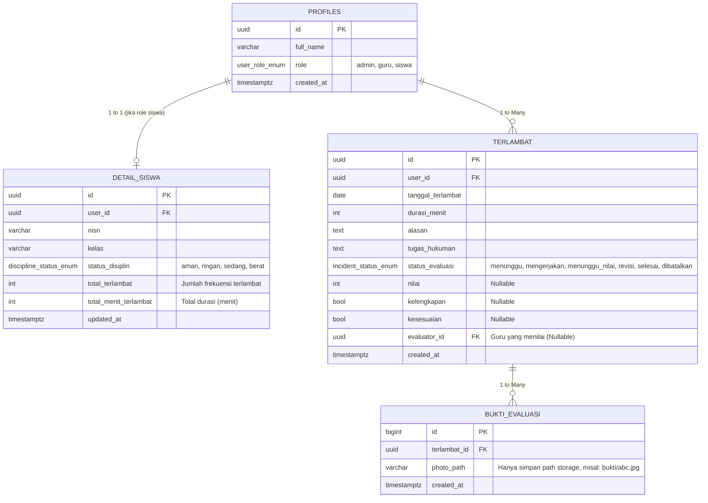

# Arsitektur Database & Panduan Schema V2 (TertibSekolah)

Dokumen ini dibuat khusus untuk mempermudah **Junior Developer** atau kontributor baru dalam memahami struktur database terbaru pada project **TertibSekolah**.

Supabase (PostgreSQL) digunakan sebagai basis data utama. Pada versi ke-2 ini, kita melakukan normalisasi struktur agar lebih rapi, konsisten, dan mudah dikembangkan.

---

## 1. Entity Relationship Diagram (ERD)

Berikut adalah relasi antar tabel dalam database kita. Diagram ini menunjukkan bagaimana setiap entitas saling terhubung:

---

## 2. Penjelasan Tabel

### A. `profiles`
Tabel utama untuk semua pengguna aplikasi (Siswa, Guru, dan Admin). Tabel ini dibuat secara otomatis setiap kali ada pendaftaran pengguna baru (melalui Firebase Auth / Supabase Auth).
*   **`id`**: ID unik pengguna (Primary Key).
*   **`full_name`**: Nama lengkap pengguna.
*   **`role`**: Peran pengguna (menggunakan ENUM: `admin`, `guru`, `siswa`).

### B. `detail_siswa`
Tabel ini merupakan perpanjangan (ekstensi) dari tabel `profiles` khusus untuk pengguna dengan role `siswa`.
*   **`nisn`** & **`kelas`**: Data spesifik siswa.
*   **`status_disiplin`**: Menentukan tingkat pelanggaran (Aman, Ringan, Sedang, Berat).
*   **`total_terlambat`** & **`total_menit_terlambat`**: Kolom agregasi untuk mempermudah perhitungan dan mempercepat query.

> [!NOTE]  
> **Trigger Otomatis:** Saat pengguna baru mendaftar dengan role `siswa` di tabel `profiles`, database secara otomatis akan membuat baris kosong (default) di tabel `detail_siswa`. Developer tidak perlu melakukan `INSERT` manual!

### C. `terlambat` (Sebelumnya `attendance`)
Menyimpan riwayat keterlambatan siswa.
*   **`durasi_menit`**: Lama keterlambatan.
*   **`tugas_hukuman`**: Hukuman/tugas yang diberikan oleh guru.
*   **`status_evaluasi`**: Status pengerjaan tugas (Menunggu, Mengerjakan, Menunggu Nilai, Revisi, Selesai, Dibatalkan).
*   **`evaluator_id`**: Guru yang mengevaluasi tugas siswa (Nullable).
*   **`nilai`, `kelengkapan`, `kesesuaian`**: Atribut evaluasi dari guru (Nullable).

### D. `bukti_evaluasi` (Sebelumnya `evaluations`)
Menyimpan lampiran bukti foto pengerjaan tugas. Relasi 1-to-Many ke tabel `terlambat` memungkinkan siswa mengunggah lebih dari 1 foto.
*   **`photo_path`**: Lokasi file di Supabase Storage (bukan Full URL).

---

## 3. Workflow & Logika Otomatis (Triggers)

Untuk mengurangi kompleksitas di sisi Frontend (Flutter), banyak logika bisnis yang sekarang dipindahkan langsung ke Database (PostgreSQL Triggers & Functions).

### 🚀 Alur Evaluasi Tugas
1. **Guru** memberikan tugas keterlambatan -> `terlambat.status_evaluasi` berubah menjadi `'mengerjakan'`.
2. **Siswa** mengunggah foto bukti -> Aplikasi Flutter melakukan `INSERT` ke `bukti_evaluasi` dan mengubah `terlambat.status_evaluasi` menjadi `'menunggu_nilai'`.
3. **Guru** memberikan nilai >= 75, kelengkapan, dan kesesuaian == True -> Aplikasi Flutter mengubah `terlambat.status_evaluasi` menjadi `'selesai'`. 
4. Jika **syarat tidak terpenuhi** -> `terlambat.status_evaluasi` diubah menjadi `'revisi'`, sehingga siswa tahu mereka harus mengunggah foto yang baru.
5. Jika **terjadi kesalahan input** -> Data tidak di-`DELETE`, melainkan `terlambat.status_evaluasi` diubah menjadi `'dibatalkan'` (Soft Delete / Audit).

### ⚡ Otomatisasi Status Disiplin
Terdapat Trigger PostgreSQL bernama `trg_update_siswa_tardiness`. 
Setiap kali ada penambahan atau perubahan data di tabel `terlambat`, sistem akan otomatis mengkalkulasi dan mengupdate agregat pada `detail_siswa`.

Setiap kali siswa terlambat dicatat, durasi dan frekuensi akan ditambahkan ke kolom `total_menit_terlambat` dan `total_terlambat` di tabel `detail_siswa`. 

Jika siswa berhasil menyelesaikan evaluasi keterlambatan nya (status `'selesai'`), maka durasi dan poin keterlambatan akan **dikurangi** dari kolom agregasi tersebut sebagai bentuk apresiasi/penebusan. Begitu juga jika status diubah menjadi `'dibatalkan'`.

Perlu diingat bahwa untuk project kali ini, kita menggunakan Database Trigger dari PostgreSQL, bukan menggunakan Supabase Functions. Hal ini dikarenakan Database Trigger lebih cepat dan efisien dalam menghitung total keterlambatan siswa, serta mengurangi kompleksitas di sisi Frontend (Flutter).

**Aturan Default (`status_disiplin`):**
*   `aman`: 0-2 kali terlambat
*   `ringan`: 3-4 kali terlambat
*   `sedang`: 5-6 kali terlambat
*   `berat`: >6 kali terlambat

> [!TIP]
> Saat melakukan operasi Join dari Frontend menggunakan Supabase SDK, gunakan format:
> `.select('id, profiles!inner(full_name, detail_siswa(kelas, status_disiplin, total_terlambat))')`

Selamat berkontribusi! Hubungi tim Backend jika membutuhkan perubahan pada Trigger atau Schema ENUM.
