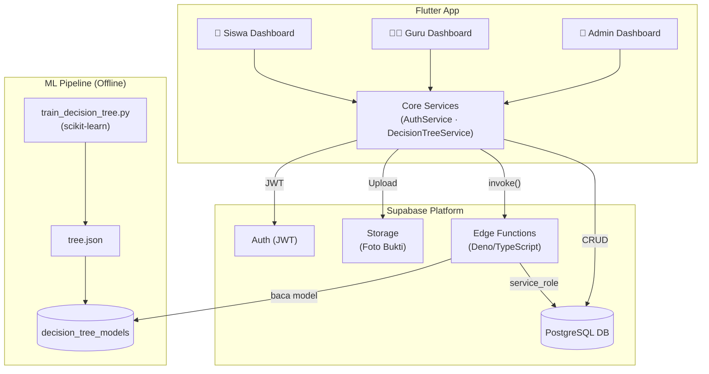

# 🏫 Tertib Sekolah — Sistem Manajemen Kedisiplinan Siswa

> Aplikasi mobile & multiplatform untuk mencatat keterlambatan siswa, mengelola siklus evaluasi tugas, dan membantu guru mengambil keputusan penilaian dengan bantuan **Decision Support System berbasis Decision Tree**.

---

## 📋 Daftar Isi

- [Gambaran Umum](#gambaran-umum)
- [Fitur Utama](#fitur-utama)
- [Arsitektur Sistem](#arsitektur-sistem)
- [Stack Teknologi](#stack-teknologi)
- [Struktur Folder](#struktur-folder)
- [Prasyarat](#prasyarat)
- [Cara Menjalankan](#cara-menjalankan)
- [Konfigurasi Supabase](#konfigurasi-supabase)
- [ML Pipeline](#ml-pipeline-decision-tree)
- [Dokumentasi Lengkap](#dokumentasi-lengkap)

---

## Gambaran Umum

**Tertib Sekolah** adalah platform manajemen kedisiplinan sekolah yang menghubungkan tiga aktor:

| Aktor | Peran |
|-------|-------|
| 👑 **Admin** | Manajemen akun pengguna (tambah/hapus guru, siswa, admin), lihat semua data |
| 👨‍🏫 **Guru / Piket** | Catat keterlambatan, evaluasi & nilai bukti tugas siswa (+ bantuan AI) |
| 🎒 **Siswa** | Pantau status keterlambatan sendiri, upload foto bukti pengerjaan tugas |

Alur bisnis utama:
```
Siswa Terlambat → Guru Input → Siswa Upload Bukti → Guru Evaluasi (+ AI) → Selesai / Revisi
```

Setiap keterlambatan yang masih aktif (belum `selesai` atau `dibatalkan`) dihitung untuk menentukan **level disiplin** siswa secara otomatis:

| Keterlambatan Aktif | Level |
|---------------------|-------|
| 0–2 kali | 🟢 Aman |
| 3–4 kali | 🟡 Ringan |
| 5–6 kali | 🟠 Sedang |
| > 6 kali | 🔴 Berat |

---

## Fitur Utama

- ✅ **Multi-role Authentication** — Login dengan role admin/guru/siswa, routing otomatis ke dashboard masing-masing
- ✅ **Pencatatan Keterlambatan** — Input durasi → tugas hukuman ditetapkan otomatis (Ringan/Sedang/Berat)
- ✅ **Siklus Evaluasi Tugas** — Status: `menunggu` → `mengerjakan` → `menunggu_nilai` → `selesai`/`revisi`
- ✅ **Upload Bukti Foto** — Ambil dari kamera/galeri, kompresi otomatis, upload ke Supabase Storage
- ✅ **Realtime Updates** — Dashboard guru & siswa otomatis refresh saat ada perubahan data
- ✅ **Decision Support System** — Prediksi hasil evaluasi (selesai/revisi) menggunakan Decision Tree dengan confidence score
- ✅ **Manajemen User** — Admin bisa tambah/hapus user via Edge Function dengan rollback otomatis
- ✅ **Row-Level Security** — Setiap pengguna hanya bisa akses data sesuai perannya

---

## Arsitektur Sistem

```
┌──────────────────────────────────────────────┐
│            Flutter App (Client)              │
│  ┌──────────┐ ┌──────────┐ ┌──────────────┐  │
│  │  Admin   │ │  Guru    │ │    Siswa     │  │
│  │Dashboard │ │Dashboard │ │  Dashboard   │  │
│  └──────────┘ └──────────┘ └──────────────┘  │
│         Core Services                        │
│  ┌─────────────┐  ┌────────────────────────┐  │
│  │ AuthService │  │ DecisionTreeService    │  │
│  └─────────────┘  └────────────────────────┘  │
└────────────────────────┬─────────────────────┘
                         │ HTTPS / WebSocket
                         ▼
┌──────────────────────────────────────────────┐
│              Supabase Platform               │
│  Auth  │  Realtime  │  Storage  │  Edge Fns  │
│                                              │
│         PostgreSQL Database                  │
│  profiles │ terlambat │ detail_siswa         │
│  bukti_evaluasi │ evaluasi_tugas             │
│  decision_tree_models                        │
└──────────────────────────────────────────────┘
                         ▲
┌────────────────────────┴─────────────────────┐
│         ML Pipeline (Offline Training)       │
│  supabase/04_ml/train_decision_tree.py       │
│  scikit-learn → tree.json → upload ke DB     │
└──────────────────────────────────────────────┘
```



---

## Stack Teknologi

### Frontend
| Paket | Versi | Kegunaan |
|-------|-------|---------|
| Flutter / Dart | SDK ^3.11.5 | Framework utama |
| supabase_flutter | ^2.9.1 | Auth, DB, Realtime, Edge Functions |
| google_fonts | ^8.1.0 | Tipografi (Manrope & Inter) |
| intl | ^0.19.0 | Format tanggal & lokalisasi Indonesia |
| image_picker | ^1.1.2 | Kamera / galeri |
| flutter_image_compress | ^2.3.0 | Kompresi foto |
| url_launcher | ^6.2.5 | Buka URL eksternal |

### Backend (Supabase)
| Komponen | Kegunaan |
|----------|---------|
| PostgreSQL 17 | Database utama |
| Supabase Auth | Login email & password (JWT) |
| Supabase Realtime | Update otomatis via WebSocket |
| Edge Functions (Deno) | `create-user`, `delete-user`, `predict-evaluation`, `submit-evaluation` |
| Supabase Storage | Penyimpanan foto bukti tugas |

### ML Pipeline
| Teknologi | Kegunaan |
|-----------|---------|
| Python 3.9+ | Script training |
| scikit-learn | Decision Tree, GridSearchCV, StratifiedKFold |
| pandas | Preprocessing dataset CSV |
| matplotlib | Visualisasi pohon keputusan |

---

## Struktur Folder

```
TertibSekolah/
├── Frontend/                          # Aplikasi Flutter
│   ├── lib/
│   │   ├── main.dart                  # Entry point + inisialisasi Supabase
│   │   ├── core/
│   │   │   ├── auth_service.dart      # Login / logout / session
│   │   │   ├── supabase_config.dart   # Validasi env vars
│   │   │   ├── decision_tree_service.dart # Prediksi & submit evaluasi ML
│   │   │   └── tardiness_service.dart # Update level keterlambatan
│   │   ├── screens/
│   │   │   ├── login_screen.dart
│   │   │   ├── admin_dashboard_screen.dart
│   │   │   ├── guru_dashboard_screen.dart
│   │   │   ├── siswa_dashboard_screen.dart
│   │   │   ├── input_keterlambatan_screen.dart
│   │   │   ├── evaluasi_tugas_screen.dart
│   │   │   ├── form_evaluasi_tugas_screen.dart
│   │   │   ├── data_siswa_screen.dart
│   │   │   └── detail_siswa_screen.dart
│   │   └── theme/
│   │       ├── app_colors.dart
│   │       └── app_theme.dart
│   ├── .env.example                   # Template env vars
│   └── pubspec.yaml
│
├── supabase/
│   ├── functions/
│   │   ├── create-user/               # Buat user baru (admin only)
│   │   ├── delete-user/               # Hapus user (admin only)
│   │   ├── predict-evaluation/        # Prediksi Decision Tree
│   │   └── submit-evaluation/         # Simpan histori evaluasi
│   ├── migrations/
│   │   └── 20260825_decision_tree.sql # Tabel ML & fungsi evaluasi
│   └── 04_ml/
│       └── train_decision_tree.py     # Script training Python
│
└── Docs/                              # Dokumentasi lengkap
```

---

## Prasyarat

Pastikan tools berikut sudah terinstal sebelum memulai:

| Tool | Versi Minimum | Keterangan |
|------|--------------|------------|
| Flutter | 3.x stable | `flutter --version` |
| Dart SDK | ^3.11.5 | Sudah termasuk Flutter |
| Git | Latest | Version control |
| VS Code / Android Studio | Latest | IDE (VS Code direkomendasikan) |
| Supabase CLI | Latest | Untuk edge functions & migrasi |
| Python | 3.9+ | Opsional — hanya untuk training ML |

---

## Cara Menjalankan

### 1. Clone Repository

```bash
git clone <repository-url>
```

### 2. Setup Flutter (Frontend)

```bash
cd TertibSekolah/Frontend

# Install dependencies
flutter pub get

# Buat file .env dari template
cp .env.example .env
```

Edit file `.env` dengan kredensial Supabase project Anda:

```env
SUPABASE_URL=https://your_project_id.supabase.co
SUPABASE_ANON_KEY=your_anon_key_here
```

> 📌 **Dapatkan kredensial** dari [Supabase Dashboard](https://supabase.com/dashboard) → Project Settings → API

### 3. Jalankan Aplikasi

**Via VS Code** (Direkomendasikan):
```
Tekan F5 → pilih "Debug (dengan .env)"
```

**Via Terminal**:
```bash
# Android
flutter run -d android --dart-define-from-file=.env

# Chrome / Web
flutter run -d chrome --dart-define-from-file=.env

# Linux Desktop
flutter run -d linux --dart-define-from-file=.env
```

### 4. Build Produksi

```bash
# Android APK
flutter build apk --dart-define-from-file=.env

# Android App Bundle (Play Store)
flutter build appbundle --dart-define-from-file=.env

# Web
flutter build web --dart-define-from-file=.env
```

---

## Konfigurasi Supabase

Jika Anda menyiapkan project Supabase baru, pastikan langkah berikut sudah dilakukan:

### 1. Jalankan Migrasi Database

```bash
# Link ke project Supabase
supabase link --project-ref <project-id>

# Push migrasi
supabase db push
```

Atau jalankan isi file `supabase/migrations/20260825_decision_tree.sql` secara manual di **Supabase Dashboard → SQL Editor**.

### 2. Deploy Edge Functions

```bash
supabase login
supabase link --project-ref <project-id>

# Deploy semua functions sekaligus
supabase functions deploy
```

### 3. Konfigurasi Storage

Buat bucket `bukti-tugas` di **Supabase Dashboard → Storage** dan aktifkan policy yang mengizinkan user terautentikasi untuk upload.

### Cek Koneksi

```bash
flutter doctor
```

Pastikan tidak ada error merah sebelum menjalankan aplikasi.

---

## ML Pipeline (Decision Tree)

Decision Support System menggunakan Decision Tree yang dilatih dari data histori evaluasi guru.

### Fase Pengumpulan Data

Saat belum ada model aktif, aplikasi berjalan normal dalam **mode manual**. Semua evaluasi guru tetap tersimpan sebagai data training di tabel `evaluasi_tugas`.

### Training Model

```bash
# Install dependencies Python
pip install scikit-learn pandas matplotlib joblib

# Ekspor dataset dari Supabase (anonim — tanpa data pribadi)
# via Supabase Dashboard → SQL Editor:
# SELECT * FROM v_dataset_decision_tree;
# → Simpan sebagai dataset.csv

# Jalankan training
python supabase/04_ml/train_decision_tree.py \
  --input dataset.csv \
  --out ./output \
  --version "dt-v1"
```

### Aktivasi Model

Setelah training, upload `tree.json` ke database:

```sql
-- Di Supabase Dashboard → SQL Editor
INSERT INTO public.decision_tree_models
  (version, tree_json, training_rows, is_active)
VALUES
  ('dt-v1', '<isi output/tree.json>', 150, true);
```

Setelah ini, form evaluasi guru akan menampilkan **saran prediksi AI** beserta confidence score.

---

## Troubleshooting Cepat

| Error | Solusi |
|-------|--------|
| `ENV VARS TIDAK DITEMUKAN` | Jalankan dengan `--dart-define-from-file=.env` |
| Login berhasil tapi data kosong | Pastikan trigger `handle_new_user` aktif di DB |
| Edge Function "Unauthorized" | Logout & login ulang untuk refresh JWT |
| Upload foto gagal | Cek bucket `bukti-tugas` & policy Storage |
| AI tidak muncul di form evaluasi | Belum ada model aktif di `decision_tree_models` |

---

## Dokumentasi Lengkap

Dokumentasi teknis lengkap tersedia di folder [`Docs/`](./Docs/):

| Dokumen | Isi |
|---------|-----|
| [01 — Arsitektur Sistem](./Docs/01_ARSITEKTUR_SISTEM.md) | Diagram arsitektur, stack teknologi, struktur folder, pola desain |
| [02 — Cara Kerja Sistem](./Docs/02_CARA_KERJA_SISTEM.md) | Alur bisnis, workflow per aktor, siklus status, ML pipeline |
| [03 — Schema Database](./Docs/03_SCHEMA_DATABASE.md) | Semua tabel, kolom, enum, trigger, fungsi, dan view |
| [04 — Keamanan & RLS](./Docs/04_KEAMANAN_RLS.md) | Policy RLS per tabel, keamanan edge functions, model ML |
| [05 — Edge Functions](./Docs/05_EDGE_FUNCTIONS.md) | API contract 4 edge functions dengan contoh request/response |
| [06 — Panduan Pengembangan](./Docs/06_PANDUAN_PENGEMBANGAN.md) | Setup lengkap, konvensi kode, migrasi DB, ML pipeline, troubleshooting |

---

## Informasi Project

| Item | Detail |
|------|--------|
| Versi Aplikasi | 1.0.0+1 |
| Platform | Android, iOS, Web, Linux, macOS, Windows |
| Bahasa | Dart (Flutter) · TypeScript (Edge Functions) · Python (ML) |
| Database | PostgreSQL 17 via Supabase |
| Supabase Project | TertibSekolahV2 (`gaiagxlmtancqreovmai`) |
| Region | Asia Pacific — Singapore |
