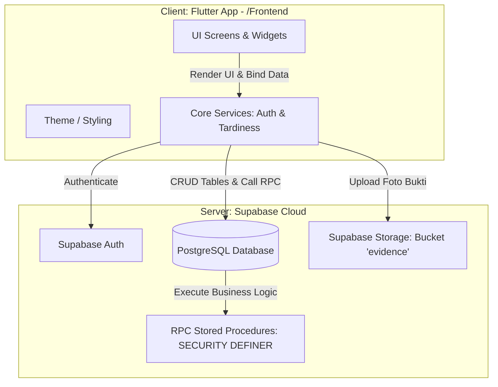
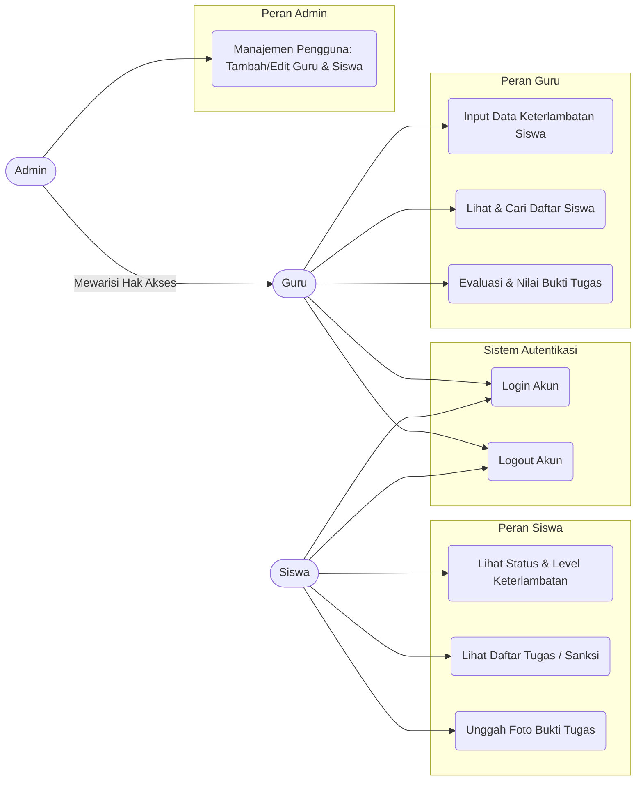
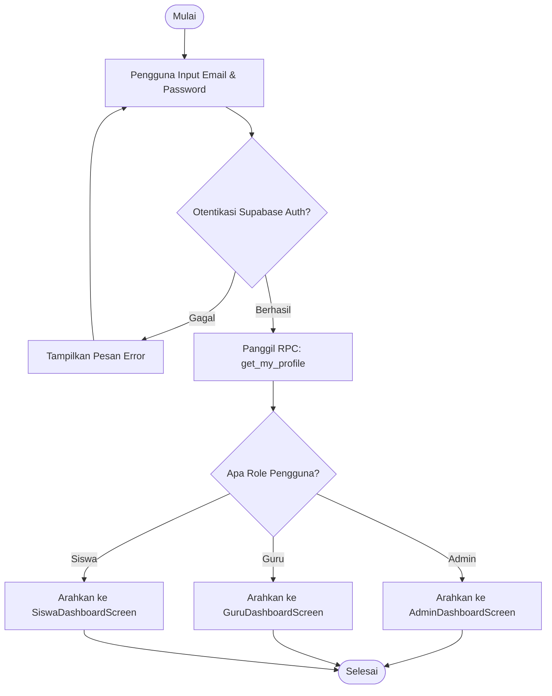
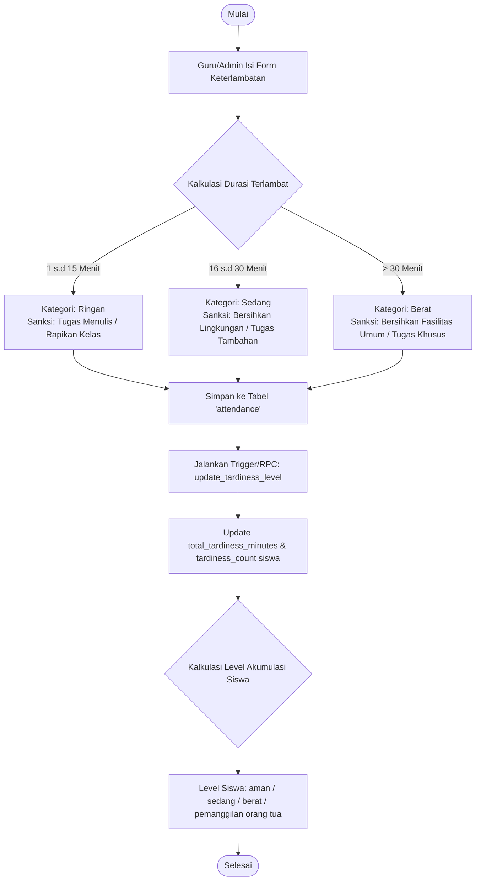
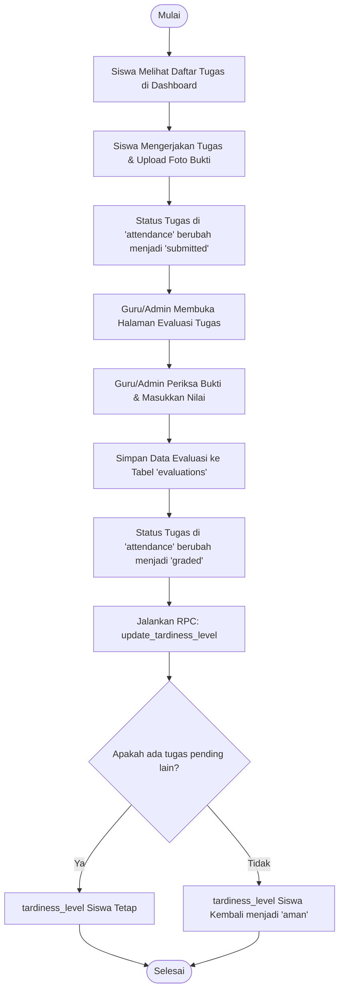
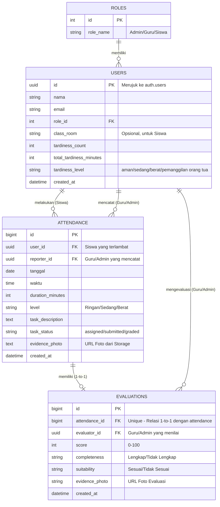

# 🏫 Tepat Waktu (Tertib Sekolah) — Sistem Manajemen Kedisiplinan & Keterlambatan Siswa

Aplikasi **Tepat Waktu (Tertib Sekolah)** adalah platform manajemen kedisiplinan sekolah berbasis mobile (Flutter) yang terintegrasi dengan backend **Supabase**. Aplikasi ini dirancang untuk mencatat data keterlambatan siswa, memberikan sanksi/tugas edukatif secara otomatis berdasarkan tingkat keterlambatan, serta melakukan evaluasi terhadap bukti penyelesaian tugas yang diunggah oleh siswa secara real-time.

Proyek ini terbagi menjadi dua bagian utama:
1. **Frontend**: Aplikasi mobile Flutter (`/Frontend`).
2. **Backend**: Database PostgreSQL dan layanan cloud Supabase (skema tabel didefinisikan dalam `database_schema.md` dan `schema.json`).

---

## 🏗️ 1. Arsitektur Aplikasi

Aplikasi ini menggunakan arsitektur **Client-Server** modern dengan membagi tanggung jawab secara jelas antara Frontend (aplikasi mobile) dan Backend (Database & Layanan Cloud).

### Diagram Blok Arsitektur



### Penjelasan Komponen Arsitektur:
1. **Frontend (Flutter Client)**:
   - **UI Layers (`lib/screens`)**: Representasi visual untuk tiap peran pengguna (Siswa, Guru, Admin).
   - **Core Services (`lib/core`)**: Kelas penengah untuk berkomunikasi dengan Supabase Client. Terdiri dari `AuthService` untuk penanganan otentikasi dan `TardinessService` untuk memperbarui status keterlambatan siswa.
   - **Theme (`lib/theme`)**: Desain sistem aplikasi menggunakan palet warna bernuansa hijau (`AppColors`) yang melambangkan kebersihan, kedisiplinan, dan lingkungan sekolah yang tertib.
2. **Backend (Supabase Cloud Server)**:
   - **Supabase Auth**: Menangani manajemen pendaftaran, sesi masuk (login), dan keamanan kredensial pengguna.
   - **PostgreSQL Database**: Penyimpanan data relasional secara konsisten dengan integritas referensial (Foreign Key).
   - **Supabase Storage**: Menyimpan file gambar bukti penyelesaian tugas (`evidence_photo`) yang dikirimkan oleh siswa ke dalam bucket khusus.
   - **RPC (Stored Procedures)**: Menjalankan logika bisnis kompleks di sisi server. Digunakan fungsi `get_my_profile` dan `update_tardiness_level` dengan hak akses `SECURITY DEFINER` untuk mem-bypass aturan RLS (Row Level Security) secara aman.

---

## 👥 2. Use Case Diagram

Aplikasi ini membagi hak akses ke dalam 3 peran (Role): **Siswa**, **Guru**, dan **Admin**. Berikut adalah use case diagram yang menggambarkan hubungan interaksi antara aktor dengan sistem:



---

## 🔄 3. Flowchart Sistem

Sistem ini memiliki tiga alur kerja utama (Core Workflows):

### A. Alur Login & Penentuan Dashboard


### B. Alur Pencatatan & Kalkulasi Tingkat Keterlambatan


### C. Alur Penyelesaian Sanksi & Evaluasi Tugas


---

## 🗄️ 4. Skema Database & Relasi (ERD)

Database aplikasi dirancang menggunakan relational model PostgreSQL di Supabase.

### Entity Relationship Diagram (ERD)



### Kamus Data Tabel Database

#### 1. Tabel `roles`
Menyimpan jenis hak akses pengguna.
| Nama Kolom | Tipe Data | Keterangan |
| :--- | :--- | :--- |
| `id` (PK) | INT | Identifikasi unik role. |
| `role_name` | VARCHAR | Nama role: `'Admin'`, `'Guru'`, atau `'Siswa'`. |

#### 2. Tabel `users`
Menyimpan profil pengguna yang terintegrasi dengan akun auth Supabase.
| Nama Kolom | Tipe Data | Keterangan |
| :--- | :--- | :--- |
| `id` (PK) | UUID | ID unik yang terhubung dengan `auth.users.id`. |
| `nama` | VARCHAR | Nama lengkap pengguna. |
| `email` | VARCHAR | Alamat email unik untuk login. |
| `role_id` (FK) | INT | Menghubungkan ke tabel `roles`. |
| `class_room` | VARCHAR | Kelas siswa (NULL untuk Guru/Admin). |
| `tardiness_count` | INT | Total berapa kali siswa telah terlambat (Default: `0`). |
| `total_tardiness_minutes`| INT | Total akumulasi menit keterlambatan (Default: `0`). |
| `tardiness_level` | VARCHAR | Level kedisiplinan: `'aman'`, `'sedang'`, `'berat'`, `'pemanggilan orang tua'`. |
| `created_at` | TIMESTAMPTZ | Waktu pembuatan akun. |

#### 3. Tabel `attendance`
Mencatat detail insiden keterlambatan dan status sanksi yang diberikan.
| Nama Kolom | Tipe Data | Keterangan |
| :--- | :--- | :--- |
| `id` (PK) | BIGINT | ID unik pencatatan kehadiran. |
| `user_id` (FK) | UUID | ID siswa yang terlambat (ke `users.id`). |
| `reporter_id` (FK) | UUID | ID guru/admin yang mencatat keterlambatan (ke `users.id`). |
| `tanggal` | DATE | Tanggal insiden keterlambatan. |
| `waktu` | TIME | Jam kedatangan siswa. |
| `duration_minutes` | INT | Durasi terlambat (dalam menit). |
| `level` | VARCHAR | Kategori pelanggaran: `'Ringan'`, `'Sedang'`, atau `'Berat'`. |
| `task_description` | TEXT | Keterangan sanksi/tugas yang harus dikerjakan. |
| `task_status` | VARCHAR | Status pengerjaan tugas: `'assigned'`, `'submitted'`, atau `'graded'`. |
| `evidence_photo` | TEXT | URL gambar bukti pengerjaan yang diunggah siswa. |
| `created_at` | TIMESTAMPTZ | Waktu pencatatan data ke sistem. |

#### 4. Tabel `evaluations`
Menyimpan hasil penilaian tugas/sanksi oleh Guru/Admin.
| Nama Kolom | Tipe Data | Keterangan |
| :--- | :--- | :--- |
| `id` (PK) | BIGINT | ID unik data evaluasi. |
| `attendance_id` (FK)| BIGINT | Referensi ke insiden `attendance.id` (Unique/1-to-1). |
| `evaluator_id` (FK) | UUID | ID guru/admin yang menilai tugas (ke `users.id`). |
| `score` | INT | Nilai tugas dalam rentang `0` sampai `100`. |
| `completeness` | VARCHAR | Kelengkapan tugas: `'Lengkap'` atau `'Tidak Lengkap'`. |
| `suitability` | VARCHAR | Kesesuaian tugas: `'Sesuai'` atau `'Tidak Sesuai'`. |
| `evidence_photo` | VARCHAR | Salinan URL foto bukti penyelesaian. |
| `created_at` | TIMESTAMPTZ | Waktu evaluasi dilakukan. |

---

## 📁 5. Struktur Direktori Project (Frontend)

Struktur kode sumber di dalam folder `/Frontend/lib/` disusun secara modular dan clean:

- [lib/core/](file:///mnt/data/Project/ProjectJurnal/TertibSekolah/Frontend/lib/core) — Berisi kode-kode logika internal dan penanganan API / Supabase.
  - [auth_service.dart](file:///mnt/data/Project/ProjectJurnal/TertibSekolah/Frontend/lib/core/auth_service.dart): Autentikasi Supabase & pemanggilan RPC profile.
  - [tardiness_service.dart](file:///mnt/data/Project/ProjectJurnal/TertibSekolah/Frontend/lib/core/tardiness_service.dart): Memperbarui status pelanggaran siswa via RPC database.
  - [supabase_config.dart](file:///mnt/data/Project/ProjectJurnal/TertibSekolah/Frontend/lib/core/supabase_config.dart): Validasi environment variable.
- [lib/screens/](file:///mnt/data/Project/ProjectJurnal/TertibSekolah/Frontend/lib/screens) — Halaman interface untuk masing-masing user role.
  - [login_screen.dart](file:///mnt/data/Project/ProjectJurnal/TertibSekolah/Frontend/lib/screens/login_screen.dart): Form login user.
  - [admin_dashboard_screen.dart](file:///mnt/data/Project/ProjectJurnal/TertibSekolah/Frontend/lib/screens/admin_dashboard_screen.dart): Dashboard khusus administrator.
  - [guru_dashboard_screen.dart](file:///mnt/data/Project/ProjectJurnal/TertibSekolah/Frontend/lib/screens/guru_dashboard_screen.dart): Dashboard perekaman keterlambatan & daftar evaluasi.
  - [siswa_dashboard_screen.dart](file:///mnt/data/Project/ProjectJurnal/TertibSekolah/Frontend/lib/screens/siswa_dashboard_screen.dart): Laporan sanksi & form upload foto bukti siswa.
  - [input_keterlambatan_screen.dart](file:///mnt/data/Project/ProjectJurnal/TertibSekolah/Frontend/lib/screens/input_keterlambatan_screen.dart): Form perekaman keterlambatan.
  - [evaluasi_tugas_screen.dart](file:///mnt/data/Project/ProjectJurnal/TertibSekolah/Frontend/lib/screens/evaluasi_tugas_screen.dart) & [form_evaluasi_tugas_screen.dart](file:///mnt/data/Project/ProjectJurnal/TertibSekolah/Frontend/lib/screens/form_evaluasi_tugas_screen.dart): Halaman peninjauan bukti tugas siswa.
  - [data_siswa_screen.dart](file:///mnt/data/Project/ProjectJurnal/TertibSekolah/Frontend/lib/screens/data_siswa_screen.dart) & [detail_siswa_screen.dart](file:///mnt/data/Project/ProjectJurnal/TertibSekolah/Frontend/lib/screens/detail_siswa_screen.dart): Monitoring statistik kedisiplinan murid.
- [lib/theme/](file:///mnt/data/Project/ProjectJurnal/TertibSekolah/Frontend/lib/theme) — Konfigurasi styling & warna visual.
  - [app_colors.dart](file:///mnt/data/Project/ProjectJurnal/TertibSekolah/Frontend/lib/theme/app_colors.dart): Palet warna utama.
  - [app_theme.dart](file:///mnt/data/Project/ProjectJurnal/TertibSekolah/Frontend/lib/theme/app_theme.dart): Modifikasi TextTheme & font.
- [main.dart](file:///mnt/data/Project/ProjectJurnal/TertibSekolah/Frontend/lib/main.dart) — Titik masuk utama aplikasi.

---

## 🚀 6. Cara Menjalankan Aplikasi

Ikuti langkah-langkah berikut untuk menjalankan frontend aplikasi Flutter secara lokal:

### Prasyarat
1. Telah menginstal **Flutter SDK** (versi minimum `3.11.5`).
2. Telah mengonfigurasi proyek di **Supabase Console** (termasuk pembuatan tabel, trigger, RPC, dan bucket storage bernama `evidence`).

### Langkah-langkah
1. **Clone repositori** ini dan masuk ke dalam direktori `Frontend`:
   ```bash
   cd Frontend
   ```
2. **Instal dependensi** yang dibutuhkan:
   ```bash
   flutter pub get
   ```
3. **Konfigurasi Variabel Lingkungan**:
   Buat file `.env` di dalam folder `Frontend/` (gunakan `.env.example` sebagai acuan) lalu isi dengan kredensial Supabase Anda:
   ```env
   SUPABASE_URL="https://alamat-proyek-anda.supabase.co"
   SUPABASE_ANON_KEY="token-anon-key-supabse-anda"
   ```
4. **Jalankan Aplikasi**:
   Pastikan emulator atau perangkat fisik Anda telah terhubung, lalu jalankan perintah:
   ```bash
   flutter run
   ```
