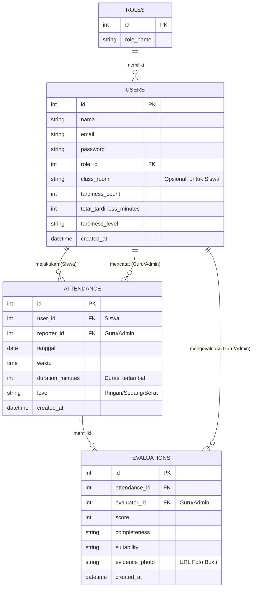

# Gambaran Database Schema: Aplikasi "Tepat Waktu"

Berdasarkan desain aplikasi **Tepat Waktu** di Google Stitch, aplikasi ini mengelola data kedisiplinan sekolah, mencakup peran pengguna (Siswa, Guru, Admin), pencatatan keterlambatan (Input Keterlambatan), hingga evaluasi tugas/hukuman beserta buktinya (Bukti Penyelesaian & Evaluasi Tugas). 

Berikut adalah rancangan tabel database relasional (SQL) yang paling sesuai untuk mendukung alur kerja (flow) aplikasi tersebut:

## Entity Relationship Diagram (ERD)

---

## Rincian Struktur Tabel

### 1. Tabel `roles`
Tabel ini menyimpan jenis peran (Role) pengguna di dalam aplikasi untuk membedakan akses antara Admin, Guru, dan Siswa.

| Kolom | Tipe Data | Keterangan |
| :--- | :--- | :--- |
| `id` | INT | Primary Key |
| `role_name` | VARCHAR(50) | Contoh: 'Admin', 'Guru', 'Siswa' |

### 2. Tabel `users`
Tabel sentral untuk menyimpan data semua pengguna aplikasi (Siswa yang terlambat, Guru yang mengevaluasi, dan Admin).

| Kolom | Tipe Data | Keterangan |
| :--- | :--- | :--- |
| `id` | INT | Primary Key |
| `nama` | VARCHAR(100) | Nama lengkap pengguna |
| `email` | VARCHAR(100) | Email (Unique) untuk keperluan Login |
| `password` | VARCHAR(255) | Password (ter-hash) |
| `role_id` | INT | Foreign Key mengarah ke tabel `roles` |
| `class_room` | VARCHAR(50) | Kelas siswa (Bisa bernilai NULL untuk Guru/Admin) |
| `tardiness_count` | INT | Total kali terlambat (Otomatis dihitung via Trigger) |
| `total_tardiness_minutes` | INT | Total menit terlambat (Otomatis dihitung via Trigger) |
| `tardiness_level` | VARCHAR(50) | 'aman', 'sedang', 'berat', 'pemanggilan orang tua' |
| `created_at` | TIMESTAMP | Waktu akun dibuat |

### 3. Tabel `attendance` (Data Keterlambatan)
Tabel ini digunakan untuk mencatat data dari halaman **"Input Keterlambatan"**.

| Kolom | Tipe Data | Keterangan |
| :--- | :--- | :--- |
| `id` | INT | Primary Key |
| `user_id` | INT | FK ke `users` (Siswa yang terlambat) |
| `reporter_id` | INT | FK ke `users` (Guru/Admin yang mencatat) - *Opsional* |
| `tanggal` | DATE | Tanggal kejadian terlambat |
| `waktu` | TIME | Jam berapa siswa datang |
| `duration_minutes` | INT | Durasi keterlambatan dalam menit |
| `level` | VARCHAR(50) | Tingkat pelanggaran (misal: 'Ringan', 'Sedang', 'Berat') |
| `created_at` | TIMESTAMP | Waktu data diinput |

### 4. Tabel `evaluations` (Data Evaluasi & Bukti)
Tabel ini digunakan untuk mendukung fitur **"Bukti Penyelesaian"**, **"Evaluasi Tugas"**, dan **"Detail Evaluasi"**. Tabel ini berelasi 1-to-1 dengan data Keterlambatan.

| Kolom | Tipe Data | Keterangan |
| :--- | :--- | :--- |
| `id` | INT | Primary Key |
| `attendance_id` | INT | FK ke `attendance` (Keterlambatan mana yang dievaluasi) |
| `evaluator_id` | INT | FK ke `users` (Guru/Admin yang memberi nilai) |
| `score` | INT | Nilai evaluasi (misal: 0-100) |
| `completeness` | VARCHAR(50) | Status kelengkapan tugas (misal: 'Lengkap', 'Tidak Lengkap') |
| `suitability` | VARCHAR(50) | Kesesuaian tugas yang dikerjakan |
| `evidence_photo` | VARCHAR(255) | Path / URL ke file foto bukti penyelesaian |
| `created_at` | TIMESTAMP | Waktu evaluasi dilakukan |

---
> [!TIP]
> **Rekomendasi Tambahan**
> Jika Anda menggunakan **Firebase (Firestore)** sebagai backend untuk aplikasi Flutter ini (bukan database SQL relational), Anda bisa menggunakan arsitektur dokumen (NoSQL) di mana data `evaluations` bisa di-embed langsung ke dalam dokumen `attendance` untuk mempercepat query saat memuat Dashboard.
