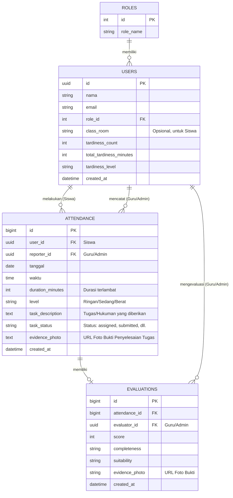

# Gambaran Database Schema: Aplikasi "Tepat Waktu"

Berdasarkan desain aplikasi **Tepat Waktu** di Google Stitch, aplikasi ini mengelola data kedisiplinan sekolah, mencakup peran pengguna (Siswa, Guru, Admin), pencatatan keterlambatan (Input Keterlambatan), hingga evaluasi tugas/hukuman beserta buktinya (Bukti Penyelesaian & Evaluasi Tugas). 

Berikut adalah rancangan tabel database relasional (SQL) yang paling sesuai untuk mendukung alur kerja (flow) aplikasi tersebut:

## Entity Relationship Diagram (ERD)

---

## Rincian Struktur Tabel

### 1. Tabel `roles`
Tabel ini menyimpan jenis peran (Role) pengguna di dalam aplikasi untuk membedakan akses antara Admin, Guru, dan Siswa.

| Kolom | Tipe Data | Keterangan |
| :--- | :--- | :--- |
| `id` | INT | Primary Key |
| `role_name` | VARCHAR | Contoh: 'Admin', 'Guru', 'Siswa' (Unique) |

### 2. Tabel `users`
Tabel sentral untuk menyimpan data semua pengguna aplikasi (Siswa yang terlambat, Guru yang mengevaluasi, dan Admin). Terhubung langsung dengan tabel `auth.users` bawaan Supabase.

| Kolom | Tipe Data | Keterangan |
| :--- | :--- | :--- |
| `id` | UUID | Primary Key, merujuk ke `auth.users.id` |
| `nama` | VARCHAR | Nama lengkap pengguna |
| `email` | VARCHAR | Email (Unique) untuk keperluan Login |
| `role_id` | INT | Foreign Key mengarah ke tabel `roles` |
| `class_room` | VARCHAR | Kelas siswa (Bisa bernilai NULL untuk Guru/Admin) |
| `tardiness_count` | INT | Total kali terlambat (Default: 0) |
| `total_tardiness_minutes` | INT | Total menit terlambat (Default: 0) |
| `tardiness_level` | VARCHAR | 'aman', 'sedang', 'berat', 'pemanggilan orang tua' (Default: 'aman') |
| `created_at` | TIMESTAMPTZ | Waktu akun dibuat |

### 3. Tabel `attendance` (Data Keterlambatan)
Tabel ini digunakan untuk mencatat data dari halaman **"Input Keterlambatan"**, serta mengelola status tugas/hukuman yang diberikan ke siswa.

| Kolom | Tipe Data | Keterangan |
| :--- | :--- | :--- |
| `id` | BIGINT | Primary Key |
| `user_id` | UUID | FK ke `users` (Siswa yang terlambat) |
| `reporter_id` | UUID | FK ke `users` (Guru/Admin yang mencatat) - *Opsional* |
| `tanggal` | DATE | Tanggal kejadian terlambat |
| `waktu` | TIME | Jam berapa siswa datang |
| `duration_minutes` | INT | Durasi keterlambatan dalam menit |
| `level` | VARCHAR | Tingkat pelanggaran (misal: 'Ringan', 'Sedang', 'Berat') |
| `task_description` | TEXT | Tugas/Hukuman yang diberikan |
| `task_status` | VARCHAR | Status tugas (Default: 'assigned') |
| `evidence_photo` | TEXT | Path / URL ke file foto bukti penyelesaian yang diupload siswa |
| `created_at` | TIMESTAMPTZ | Waktu data diinput |

### 4. Tabel `evaluations` (Data Evaluasi & Bukti)
Tabel ini digunakan untuk mendukung fitur **"Evaluasi Tugas"**, dan **"Detail Evaluasi"**. Tabel ini berelasi 1-to-1 dengan data Keterlambatan.

| Kolom | Tipe Data | Keterangan |
| :--- | :--- | :--- |
| `id` | BIGINT | Primary Key |
| `attendance_id` | BIGINT | FK ke `attendance` (Keterlambatan mana yang dievaluasi, Unique) |
| `evaluator_id` | UUID | FK ke `users` (Guru/Admin yang memberi nilai) |
| `score` | INT | Nilai evaluasi (misal: 0-100) |
| `completeness` | VARCHAR | Status kelengkapan tugas ('Lengkap', 'Tidak Lengkap') |
| `suitability` | VARCHAR | Kesesuaian tugas yang dikerjakan |
| `evidence_photo` | VARCHAR | Path / URL ke file foto bukti penyelesaian |
| `created_at` | TIMESTAMPTZ | Waktu evaluasi dilakukan |

---
> [!TIP]
> **Rekomendasi Tambahan**
> Jika Anda menggunakan **Firebase (Firestore)** sebagai backend untuk aplikasi Flutter ini (bukan database SQL relational), Anda bisa menggunakan arsitektur dokumen (NoSQL) di mana data `evaluations` bisa di-embed langsung ke dalam dokumen `attendance` untuk mempercepat query saat memuat Dashboard.
