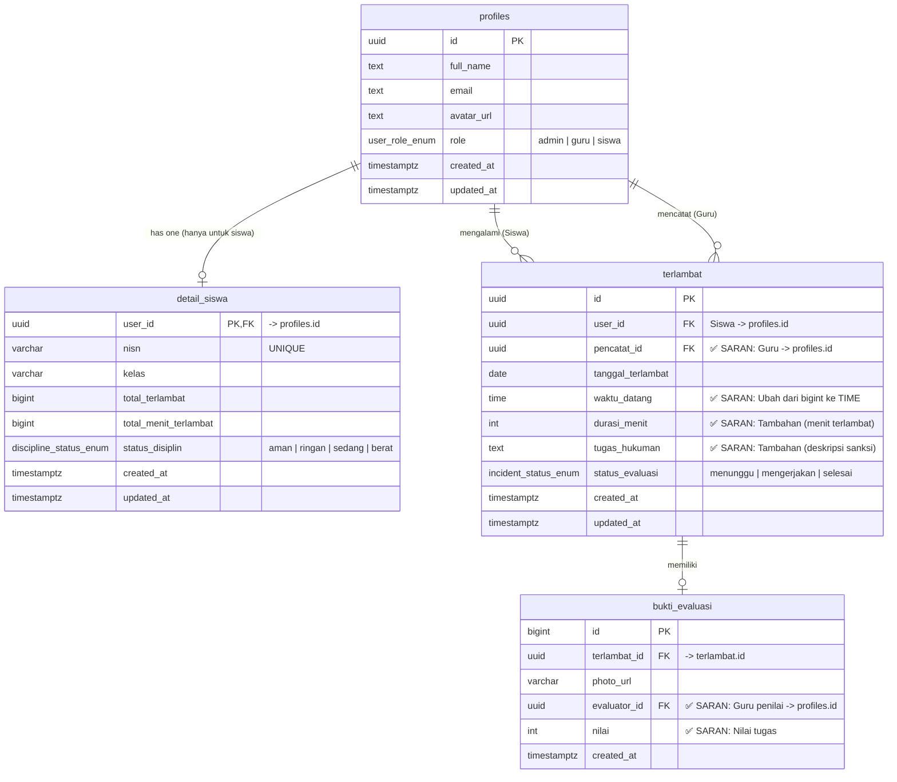

# Analisa dan Saran Skema Database V2 "Tepat Waktu"

## Pendapat Mengenai Skema Baru (V2)

Saya telah menganalisa skema database terbaru Anda di project Supabase (`TertibSekolahV2`). Secara keseluruhan, **skema baru ini jauh lebih baik, profesional, dan efisien** dibandingkan dengan desain awal Anda! Anda telah mengimplementasikan beberapa *best practices* database relasional dengan sangat baik.

### Kekuatan Skema Baru Anda:
1. **Penggunaan ENUM**: Anda telah mengubah nilai-nilai statis (`role`, `status_disiplin`, `status_evaluasi`) menjadi tipe `ENUM` (`user_role_enum`, `discipline_status_enum`, `incident_status_enum`). Ini sangat bagus! Langkah ini akan mencegah *typo* dari aplikasi (frontend), menjamin konsistensi data, dan menghemat ruang penyimpanan.
2. **Pemisahan `profiles` dan `detail_siswa`**: Ini adalah keputusan arsitektur yang sangat tepat. Karena Guru dan Admin tidak memiliki "total keterlambatan", memindahkan metrik keterlambatan ke tabel `detail_siswa` membuat tabel utama `profiles` menjadi sangat bersih.
3. **Integrasi Standar Supabase**: Menggunakan tabel `profiles` dengan tipe data UUID (yang biasanya berelasi 1-to-1 dengan tabel `auth.users` Supabase) adalah cara standar dan paling aman untuk mengelola user di Supabase.

---

## Saran Peningkatan (Area for Improvement)

Untuk membuat skema ini *production-ready* (siap rilis), saya memiliki beberapa saran yang bisa Anda pertimbangkan untuk mempermudah pekerjaan Anda dan tim *frontend* ke depannya:

### 1. Tipe Data `waktu_terlambat` (Tabel `terlambat`)
Saat ini, kolom `waktu_terlambat` menggunakan tipe data `BIGINT`. Jika ini dimaksudkan untuk menyimpan jam kedatangan siswa (misal: "07:15:00"), sangat disarankan untuk mengubah tipe datanya menjadi **`TIME`** (Time without time zone). Jika yang dimaksud adalah "durasi keterlambatan" (misal: telat 15 menit), sebaiknya ganti nama kolom menjadi `durasi_menit` dan gunakan tipe **`INT`** atau **`SMALLINT`**. Menggunakan `BIGINT` untuk waktu akan menyulitkan developer frontend saat me-render (menampilkan) data ke UI.

### 2. Kolom Relasional yang Hilang (Tabel `terlambat`)
Di skema awal, ada kejelasan mengenai *siapa yang mencatat* dan *apa tugas/hukumannya*. Di skema V2 ini, beberapa kolom penting tersebut hilang:
- **`pencatat_id`**: Kita tahu siapa siswa yang telat (`user_id`), tapi kita tidak tahu Guru/Admin mana yang menginput data ini. Sebaiknya tambahkan relasi kembali ke tabel `profiles`.
- **`tugas_hukuman`**: Jika siswa telat, hukuman apa yang harus dia kerjakan dan difoto buktinya? Tambahkan kolom deskripsi tugas.

### 3. Detail Evaluasi (Tabel `bukti_evaluasi`)
Tabel `bukti_evaluasi` saat ini hanya berisi `photo_url`. Apakah Anda masih memerlukan proses "Penilaian/Skoring" seperti pada skema awal? Jika iya, Anda perlu menambahkan kembali kolom seperti `evaluator_id` (Guru yang menilai) dan `nilai` (Skor). Jika tidak, dan prosesnya hanya *upload* bukti, maka desain Anda saat ini sudah cukup.

### 4. Gunakan Database Trigger
Karena `detail_siswa` menyimpan **total agregasi** (`total_terlambat` dan `total_menit_terlambat`), jangan biarkan aplikasi (frontend/Flutter) yang meng-*update* nilai ini secara manual. Buatlah sebuah **PostgreSQL Trigger** yang secara otomatis menjumlahkan durasi dan menambah +1 ke `total_terlambat` setiap kali ada baris baru di-insert ke tabel `terlambat`.

---

## Visualisasi Skema yang Disarankan (Graph)

Berikut adalah visualisasi ERD (Entity Relationship Diagram) yang memadukan keunggulan skema V2 Anda dengan beberapa **saran tambahan** di atas agar lebih mudah dimengerti oleh *Junior Developer* atau kontributor proyek:

**Keterangan ENUM (Tipe Data Kustom):**
- `user_role_enum`: `['admin', 'guru', 'siswa']`
- `discipline_status_enum`: `['aman', 'ringan', 'sedang', 'berat']`
- `incident_status_enum`: `['menunggu', 'mengerjakan', 'selesai']`
